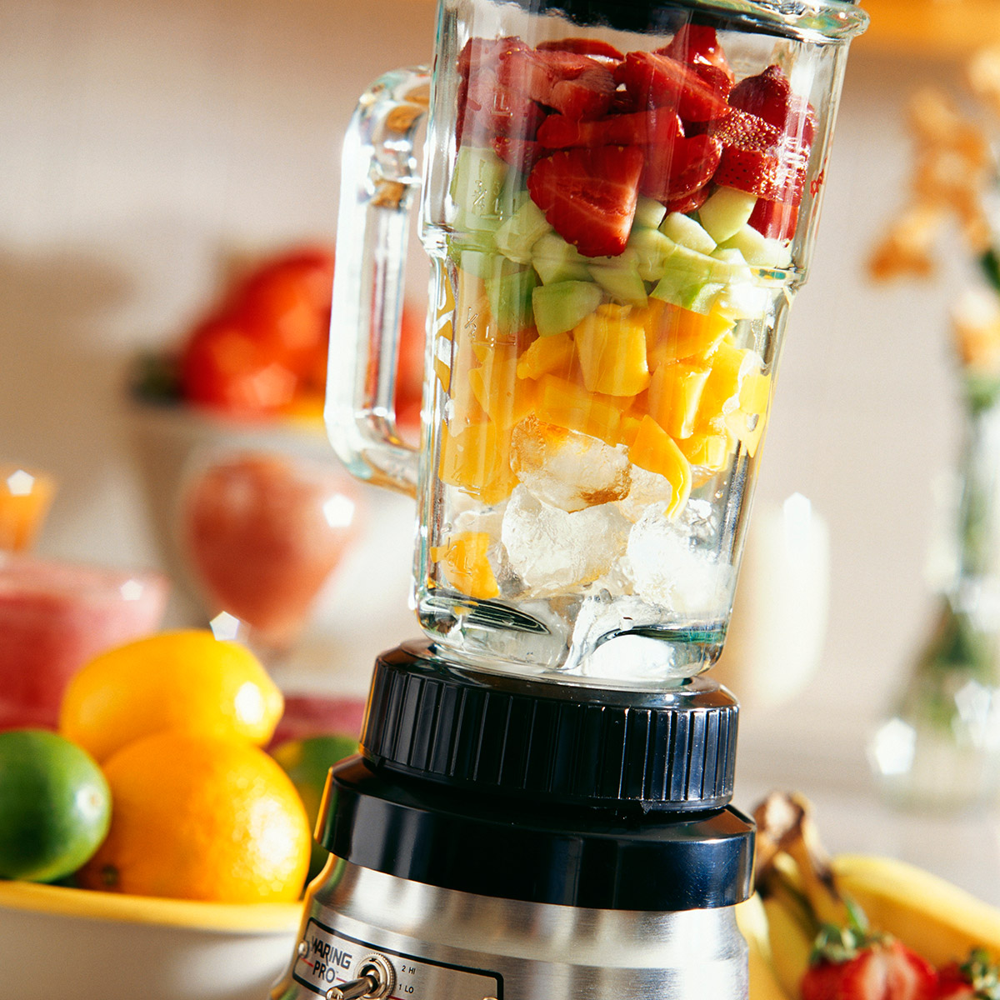

# ZocialBlendR

## Description 

A social media aggregator based on user preferences.  

## User Story

As a user interested in diverse content,  
I want to use a web application that aggregates content,   
and that facilitates the exploration of interesting posts and videos.   

## Acceptance Criteria

Given a user on the application homepage,  
When the user inputs their interests,  
Then the application should fetch and  
display popular Reddit posts related to the user's interests.  

Given a user on the application homepage,  
When the user inputs their interests,  
Then the application should fetch and display  
relevant YouTube videos matching the user's interests.  
Given displayed content from both Reddit and YouTube,  
When the user interacts with a post or video,  
The user is taken to that post or video directly.  

## Technologies Used

- Google Slides
- VS Code, HTML
- CSS Library used: Material UI https://mui.com/
- API Reddit - [reddit API and Youtube API](https://www.reddit.com/dev/api)
- API YouTube - [https://www.youtube.com/yt/dev/api-resources.html
](https://www.youtube.com/yt/dev/api-resources.html)

## Breakdown of Tasks

Melissa Wright: Front End Lead: Working with Style and Landing Page  
Stephen Scheiman: Backend Lead: Working with API fetch/response  
Jonathan Campos: Quality Assurance Lead: Testing & User Feedback  

## Challenges

- Initial group composition changed. 
- Level of Engagement/Participation varied from each member of the team. 
- Unexpected complexities with Material UI
- "Interesting" API documentation

## High Level Breakdown of Tasks

- Create main repository
- Create project board
- Import APIs
- Import CSS/Material UI
- Delegate responsibilities to three team members
- Create code
- Test code
- Document code

## Resources Links and Credits 

https://stackoverflow.com/questions/32523353/using-material-ui-in-html-development#:~:text=you%20will%20need%20to%20add%20material.css%20and%20ripple.css,file%20for%20js%20file%20material.js%20material.min.js%20and%20ripples.min.js  

https://stackoverflow.com/questions/31075893/how-to-fix-favicon-ico-error-failed-to-load-resource-neterr-empty-response  

## Application Screenshot (placeholder: update before v1.0 deploy)

## Source Code Repository

https://github.com/stephen-scheiman/ZocialBlendR

## Application Deployment Site

https://stephen-scheiman.github.io/ZocialBlendR/